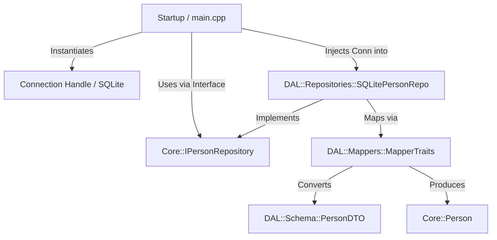

# CodeFirstCppDB_sqlgen (v3.0)

A high-performance, **Code-First Database Engine** built with **C++23 Modules** (`import std;`, `import core;`, `import dal;`), static compile-time reflection (`reflect-cpp`), type-safe SQL query generation (`sqlgen`), concept-constrained generic repositories, and clean **Dependency Injection**.

---

## 1. Quick Start

### Build Requirements

* **Compiler**: Clang 18+ (recommended, with `libc++` and native `import std;` support) or GCC 14+
* **Build System**: CMake 3.30+ (configured with `FILE_SET CXX_MODULES`) and Ninja
* **Dependencies**: `SQLite3` system library (`libsqlite3-dev` / `sqlite`)
* **Submodules**: GoogleTest, reflect-cpp, sqlgen (included in `extern/`)

### Clone & Initialize

```bash
git clone <repo-url>
cd CodeFirstCppDB_sqlgen
git submodule update --init --recursive
```

### Build & Run via CMake Presets

Using the Clang Debug preset (configured with Ninja and `libc++`):

```bash
# 1. Configure and Build the Project
cmake --preset clang-debug
cmake --build --preset build-clang-debug

# 2. Run the Startup Binary (Generates relationalDB.db in solution root)
./build/linux/arch/clang/debug/Startup/Startup

# 3. Run Google Test Suite (9 Unit Tests)
./build/linux/arch/clang/debug/DAL/tests/test_DAL
```

### Inspecting the Generated SQLite Database

The application creates `relationalDB.db` in the root of the project. You can inspect its tables and inserted records using `sqlite3`:

```bash
sqlite3 relationalDB.db ".tables"
sqlite3 relationalDB.db "SELECT * FROM PersonDTO;"
sqlite3 relationalDB.db "SELECT * FROM SomethingDTO;"
sqlite3 relationalDB.db "SELECT * FROM Person_SomethingDTO;"
```

---

## 2. Architecture Overview

The project is structured into **3 distinct C++23 modules / subprojects** adhering to clean architecture, single responsibility, and explicit dependency inversion.

```
CodeFirstCppDB_sqlgen/
├── CMakeLists.txt                 # Root CMake configuration (C++23 standard)
├── CMakePresets.json              # Clang/GCC build presets
├── relationalDB.db                # Auto-generated SQLite database (at root)
│
├── Core/                          # Domain Layer (Pure C++23 Module)
│   ├── CMakeLists.txt
│   ├── core.ixx                    # Export module core (aggregates submodules)
│   ├── entities/                   # Domain Entities (Private fields, public accessors)
│   │   ├── Person.ixx              # Core::Person
│   │   ├── Something.ixx           # Core::Something
│   │   └── Person_Something.ixx    # Core::Person_Something
│   └── repositories/               # Pure Interfaces (Zero DB dependencies)
│       ├── IGenericRepository.ixx   # Core::IGenericRepository<T>
│       ├── IPersonRepository.ixx    # Core::IPersonRepository
│       ├── ISomethingRepository.ixx # Core::ISomethingRepository
│       └── IPerson_SomethingRepository.ixx
│
├── DAL/                           # Data Access Layer (C++23 Module)
│   ├── CMakeLists.txt
│   ├── dal.ixx                     # Export module dal (aggregates submodules)
│   ├── schema/                     # Relational DTO Schemas (POD structs for sqlgen)
│   │   ├── PersonDTO.ixx           # DAL::Schema::PersonDTO
│   │   ├── SomethingDTO.ixx        # DAL::Schema::SomethingDTO
│   │   └── Person_SomethingDTO.ixx # DAL::Schema::Person_SomethingDTO
│   ├── mappers/                    # Bidirectional Domain <-> DTO Mappers
│   │   └── MapperTraits.ixx        # DAL::Mappers::MapperTraits<Domain, DTO>
│   ├── repositories/               # Generic & Concrete Repository Implementations
│   │   ├── GenericRepository.ixx   # DAL::Repositories::GenericRepository<Domain, DTO, Conn>
│   │   ├── SQLitePersonRepo.ixx    # DAL::Repositories::SQLitePersonRepo<Conn>
│   │   ├── SQLiteSomethingRepo.ixx # DAL::Repositories::SQLiteSomethingRepo<Conn>
│   │   └── SQLitePerson_SomethingRepo.ixx
│   └── tests/                      # Unit Tests
│       ├── CMakeLists.txt
│       └── test_DAL.cpp            # Google Test Suite (9 Tests)
│
├── Startup/                       # Application Entry Point & Wireup
│   ├── CMakeLists.txt
│   └── main.cpp                    # Driver initialization, schema creation & seeding
│
└── extern/                        # Third-party Dependencies
    ├── googletest/                 # GoogleTest framework
    ├── reflect-cpp/                # Compile-time static reflection
    └── sqlgen/                     # Type-safe C++ SQL generator & ORM
```

### Layer Responsibilities

| Layer | Responsibilities | Constraints / Rules |
| :--- | :--- | :--- |
| **Core** | Contains pure domain entities (`Core::Person`, `Core::Something`), core domain logic, and abstract repository contracts (`Core::IPersonRepository`). | **Zero** external database dependencies. No references to `DAL`, `sqlgen`, or `SQLite3`. Use C++ encapsulation (classes with private members). |
| **DAL::Schema** | Plain-Old-Data (POD) DTO structs (`DAL::Schema::PersonDTO`) matching database table layouts. | Constrained by C++20 concepts (`RelationalEntity`). Pure data structures with public fields for static reflection. |
| **DAL::Mappers** | Specialized traits (`DAL::Mappers::MapperTraits<Domain, DTO>`) converting between DTO structs and Core domain entities. | Constrained by `Mappable<Domain, DTO>` concept. Encapsulates all translation logic between relational schemas and domain objects. |
| **DAL::Repositories**| Generic repository implementations (`GenericRepository<Domain, DTO, Conn>`) providing CRUD operations, alongside specialized repositories (`SQLitePersonRepo`). | Implements `Core` interfaces. Accepts generic connection handles conforming to `DatabaseConnection` concept. |
| **Startup** | Application entry point (`main.cpp`), database initialization, table creation, seed data insertion, and Dependency Injection wiring. | Connects concrete DAL repositories with Core interfaces. |

### Dependency Injection Flow



---

## 3. Areas for Improvement

### A. Architectural Enhancements

1. **Unified `IDatabaseConnection` Abstraction**:
   Currently, database connection handles are passed as generic template parameters (`typename ConnectionHandle`). Introducing an abstract `IDatabaseConnection` interface inside `DAL` will remove template propagation up the call stack, enabling dynamic connection pooling, connection lifetime management, and easier mocking without template instantiation overhead.

2. **Unit of Work & Transaction Management**:
   Introduce a `IUnitOfWork` / `TransactionScope` module inside `DAL`. This will allow multi-repository updates (e.g., creating a `Person` and associating a `Something` in `Person_Something`) to execute atomically inside a single SQLite `BEGIN TRANSACTION ... COMMIT / ROLLBACK` block.

3. **Error Handling with `std::expected`**:
   Replace plain boolean return values (`bool insert_one(...)`) and optional return values with `std::expected<T, RepositoryError>`. This provides explicit error diagnostics (e.g., `DuplicateKey`, `ConnectionFailed`, `ConstraintViolation`) across layer boundaries.

### B. Leveraging C++26 Features

1. **P2996 Reflection (`std::reflection`)**:
   Future adoption of C++26 native reflection will replace external header dependencies (`reflect-cpp`) with compiler-native static inspection (`^PersonDTO`). This will eliminate global fragment macro tricks, shrink binary sizes, and accelerate build times.

2. **P2900 Contracts (`std::contracts`)**:
   Apply native contract preconditions, postconditions, and assertions to domain entities and repository interfaces:
   ```cpp
   class Person {
   public:
       void setFirstName(std::string name)
           pre(!name.empty())
           post(!firstName_.empty());
   };
   ```

3. **P2300 `std::execution` (Sender/Receiver Model)**:
   Integrate `std::execution` async pipelines to offload database query execution, mapping, and file I/O to background thread pools asynchronously without blocking main looper or UI threads.

### C. Software Engineering Best Practices

1. **Rich Domain Validation**:
   Enforce domain invariants inside `Core` entity constructors and setters (e.g., ID > 0, email format validation, string length limits). Return validation results via `std::expected<void, ValidationError>`.

2. **Constexpr Query Synthesis**:
   Evaluate static SQL statement generation at compile time where possible, pre-building query templates to reduce runtime string formatting overhead.

3. **Strict Zero-Header Leakage in Modules**:
   Continue refining C++23 module boundaries to ensure zero third-party headers (`<sqlite3.h>`) leak into user code.

### D. Database Security & Hardening

1. **Prepared Statement & Parameter Binding Safeguards**:
   Ensure all query execution paths strictly use parameterized bound queries (`sqlgen` AST expressions) to completely prevent SQL injection vulnerabilities.

2. **Database File Permission Hardening**:
   Apply OS file access restrictions (`0600` / `rw-------`) on generated `.db` files when initialized in production environments to prevent unauthorized local reading.

3. **Encryption at Rest**:
   Integrate **SQLCipher** or SQLite Encryption Extension (SEE) into `DAL` connection handles for transparent database file encryption at rest.

4. **Secrets & Environment Configuration**:
   Move database connection strings, credentials, and encryption keys out of source code into environment variables or dedicated secret management providers.

### E. Code-First Schema Migrations & Versioning Engine

A key addition for code-first C++ database frameworks is an **Automated Schema Migration Engine**:
- **Metadata Version Tracking**: Store schema version state in SQLite using `PRAGMA user_version` or a `__schema_migrations` internal system table.
- **DTO Reflection Comparison**: At application startup, reflect over registered DTO types (`PersonDTO`, `SomethingDTO`), inspect existing database table columns via `PRAGMA table_info(...)`, and detect missing columns or altered types.
- **Automatic Migration Execution**: Automatically execute non-destructive DDL statements (`ALTER TABLE ... ADD COLUMN`) or prompt for versioned migration scripts before repository initialization, guaranteeing database schema synchronization across deployments without data loss.
