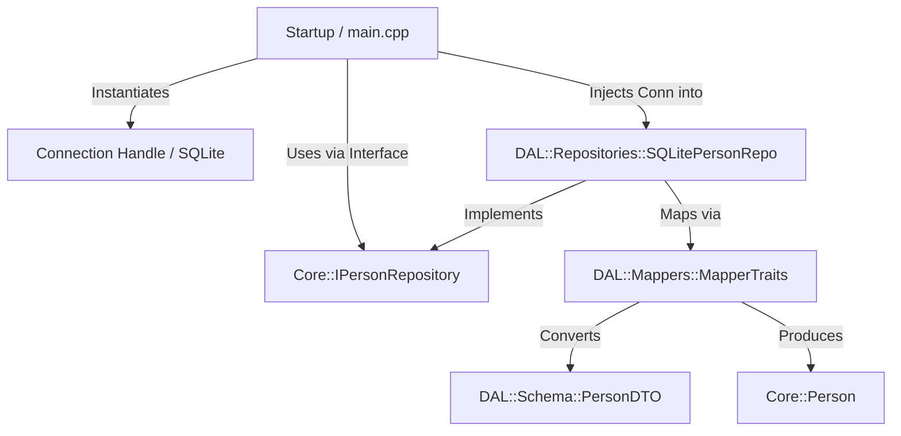

# CodeFirstCppDB_sqlgen

C++26 code-first database prototype exploring native compile-time reflection, C++ modules, concepts, templates, std::expected, sqlgen and SQLite. Currently, the experiment consists in:

```text
C++ types -> C++26 static reflection -> relational DTO/schema metadata -> sqlgen -> SQLite
```

The project is intentionally experimental and compiler-oriented. The primary target is **GCC 16.x with C++26 reflection support**.

---

## 1. Quick Start

### Clone, Initialize, Configure, Build

```bash
git clone <repo-url>
cd CodeFirstCppDB_sqlgen
git submodule update --init --recursive
```

.vscode has gcc configuration and build (you have tests for temporary db, and startup that creates the db permenantly)


## 2. Architecture Overview

The project is structured into **3 distinct modules / subprojects** adhering to clean architecture, single responsibility, and explicit dependency inversion.

```text
CodeFirstCppDB_sqlgen/
├── CMakeLists.txt
├── CMakePresets.json
├── relationalDB.db
│
├── Core/
│   ├── CMakeLists.txt
│   ├── core.ixx
│   ├── Id.ixx
│   ├── entities/
│   │   ├── Person.ixx
│   │   ├── Something.ixx
│   │   └── Person_Something.ixx
│   └── repositories/
│       ├── DbError.ixx
│       ├── IGenericRepository.ixx
│       ├── IPersonRepository.ixx
│       ├── ISomethingRepository.ixx
│       └── IPerson_SomethingRepository.ixx
│
├── DAL/
│   ├── CMakeLists.txt
│   ├── dal.ixx
│   ├── mappers/
│   │   └── MapperTraits.ixx
│   ├── schema/
│   │   ├── SchemaTraits.ixx
│   │   ├── PersonDTO.ixx
│   │   ├── SomethingDTO.ixx
│   │   └── Person_SomethingDTO.ixx
│   ├── repositories/
│   │   ├── GenericRepository.ixx
│   │   ├── SQLitePersonRepo.ixx
│   │   ├── SQLiteSomethingRepo.ixx
│   │   └── SQLitePerson_SomethingRepo.ixx
│   └── tests/
│       ├── CMakeLists.txt
│       └── test_DAL.cpp
│
├── Startup/
│   ├── CMakeLists.txt
│   └── main.cpp
│
└── extern/
    ├── googletest/
    ├── reflect-cpp/
    └── sqlgen/
```

### Layer Responsibilities

| Layer | Responsibilities | Constraints / Rules |
| :--- | :--- | :--- |
| **Core** | Contains pure domain entities (`Core::Person`, `Core::Something`), core domain logic, and abstract repository contracts (`Core::IPersonRepository`). | **Zero** external database dependencies. No references to `DAL`, `sqlgen`, or `SQLite3`. Use C++ encapsulation (classes with private members). |
| **DAL::Schema** | Plain-Old-Data (POD) DTO structs (`DAL::Schema::PersonDTO`) matching database table layouts. | Constrained by C++20 concepts (`RelationalEntity`). Pure data structures with public fields for static reflection. |
| **DAL::Mappers** | Specialized traits (`DAL::Mappers::MapperTraits<Domain, DTO>`) converting between DTO structs and Core domain entities. | Constrained by `Mappable<Domain, DTO>` concept. Encapsulates all translation logic between relational schemas and domain objects. |
| **DAL::Repositories**| Generic repository implementations (`GenericRepository<Domain, DTO, Conn>`) providing CRUD operations, alongside specialized repositories (`SQLitePersonRepo`). | Implements `Core` interfaces. Accepts generic connection handles conforming to `DatabaseConnection` concept. |
| **Startup** | Application entry point (`main.cpp`), database initialization, table creation, seed data insertion, and Dependency Injection wiring. | Connects concrete DAL repositories with Core interfaces. |

### Dependency Injection Flow



---
